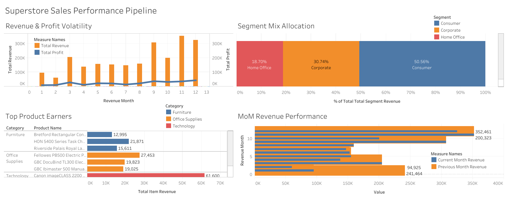

# Superstore Sales Performance Pipeline: SQL & Tableau Integration

This repository houses an end-to-end business intelligence pipeline analyzing enterprise retail transactions. The workflow handles backend data aggregation and financial KPI engineering using complex SQL window operations, structural modeling within Google Sheets, and final interactive executive dashboard delivery via Tableau.

### Live Interactive Portals & Project Assets
* **Interactive Data Visualization:** [Click Here to View the Live Tableau Dashboard](https://public.tableau.com/app/profile/sneka.shanmugavelan/vizzes)
* **Spreadsheet Architecture:** [Click Here to Inspect the Final Google Sheet Model](https://docs.google.com/spreadsheets/d/1EyG2mrIgtvazyPWCwpu7Q6H64pQL7rxd2QSlqe07OAY/edit?gid=223034233#gid=223034233)

### Dashboard Preview
Below is the core operational layout of the finalized retail analytics dashboard:

### Step 1: Database Engineering & SQL Query Architecture
Before building the visuals, I engineered structured SQL aggregation queries to isolate key revenue performance drivers from a dataset of over 9,000 transactions [(samplesuperstore)](https://docs.google.com/spreadsheets/d/1EyG2mrIgtvazyPWCwpu7Q6H64pQL7rxd2QSlqe07OAY/edit?gid=223034233#gid=223034233)
 

The baseline script is saved in this repository as [Analytical_Data_Extraction.sql](`Analytical_Data_Extraction.sql`)
 and covers four production operations:
1. **Monthly Performance Trends:** Extracting granular year/month dimensions to track total orders alongside rolling revenue and profit margins.
2. **Customer Segment Value Mapping:** Aggregating purchase values by corporate segments to measure comparative profit margin percentages.
3. **Top 3 Products by Category Partition:** Leveraging analytical window operations (`DENSE_RANK() OVER (PARTITION BY...)`) and filtration filters (`QUALIFY`) to dynamically extract the top 3 revenue-generating items inside each product category.
4. **Month-over-Month (MoM) Growth Velocity:** Implementing sequential offset analytics (`LAG() OVER (ORDER BY...)`) inside complex Common Table Expressions (CTEs) to measure running revenue growth rates across the calendar timeline.

### Step 2: Spreadsheet Data Modeling (Google Sheets)
Once the consolidated query blocks were extracted, the aggregated grids were processed inside Google Sheets to organize the data schema for reporting.
* **Data Sanitization:** Utilized advanced lookup vectors (`INDEX/MATCH`) and logical arrays to resolve formatting anomalies.
* **Pivot Modeling:** Structured target pivot frameworks to compute regional sales run-rates and localized performance benchmarks.

### Step 3: Executive Reporting (Tableau Public)
The final clean data layer was connected to Tableau to deliver an interactive, self-service dashboard designed for retail stakeholders.
* **High-Level Financial KPIs:** Structured card layers displaying total revenues, absolute profits, and target margin boundaries.
* **Dynamic Time-Series Analytics:** Implemented interactive date sliders and segment-specific dropdown filters so users can slice cross-validation metrics instantly.

